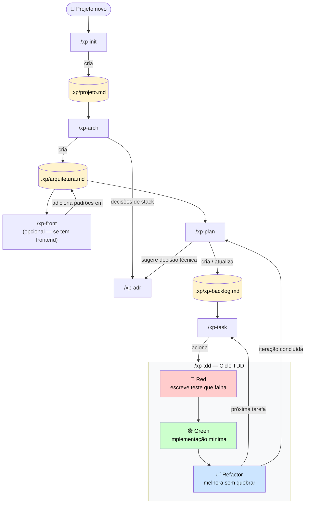
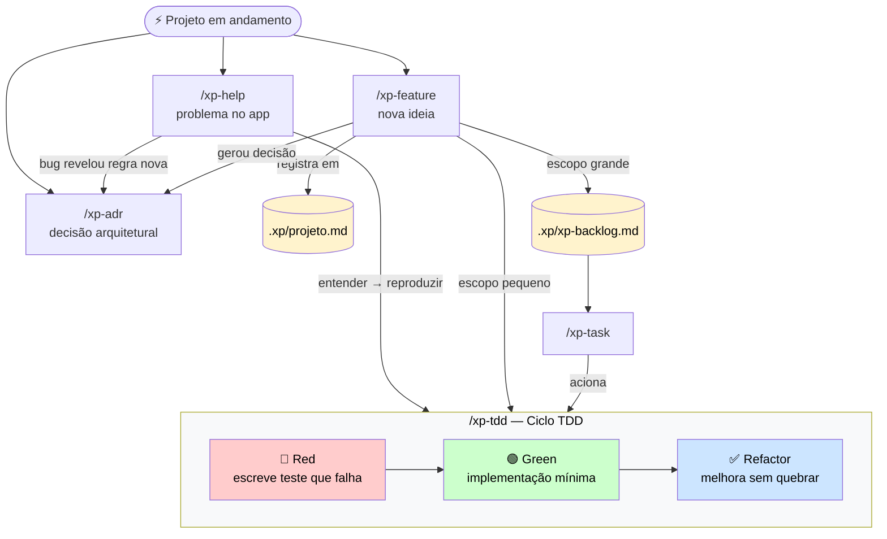
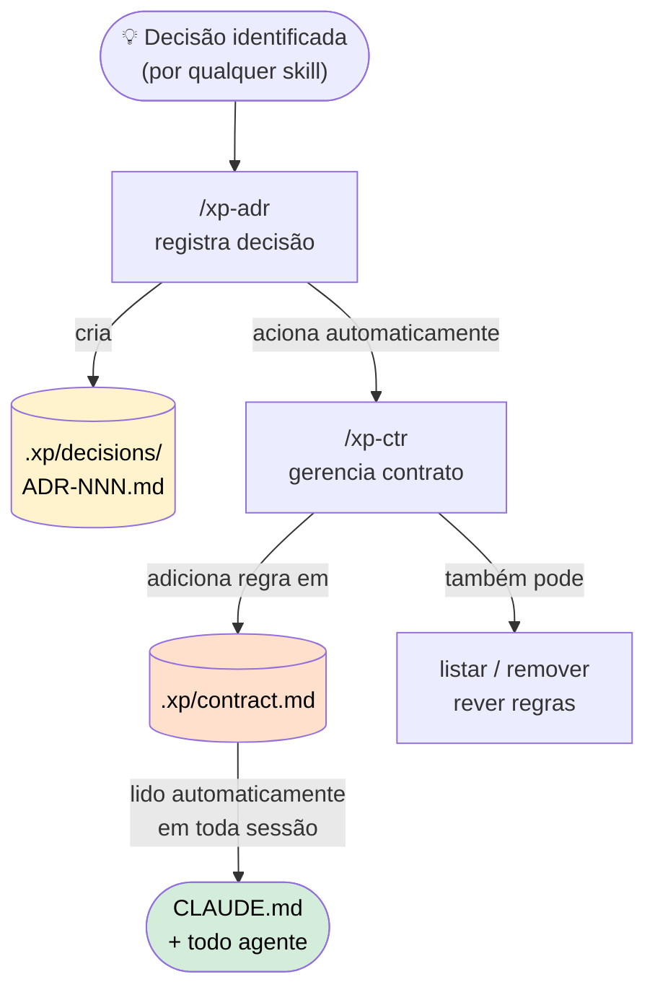
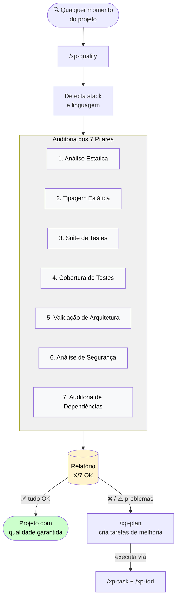
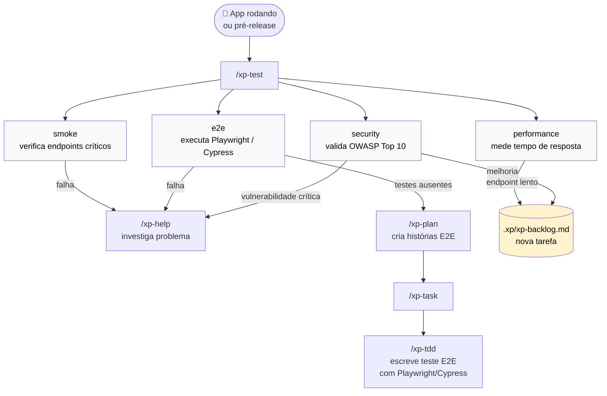
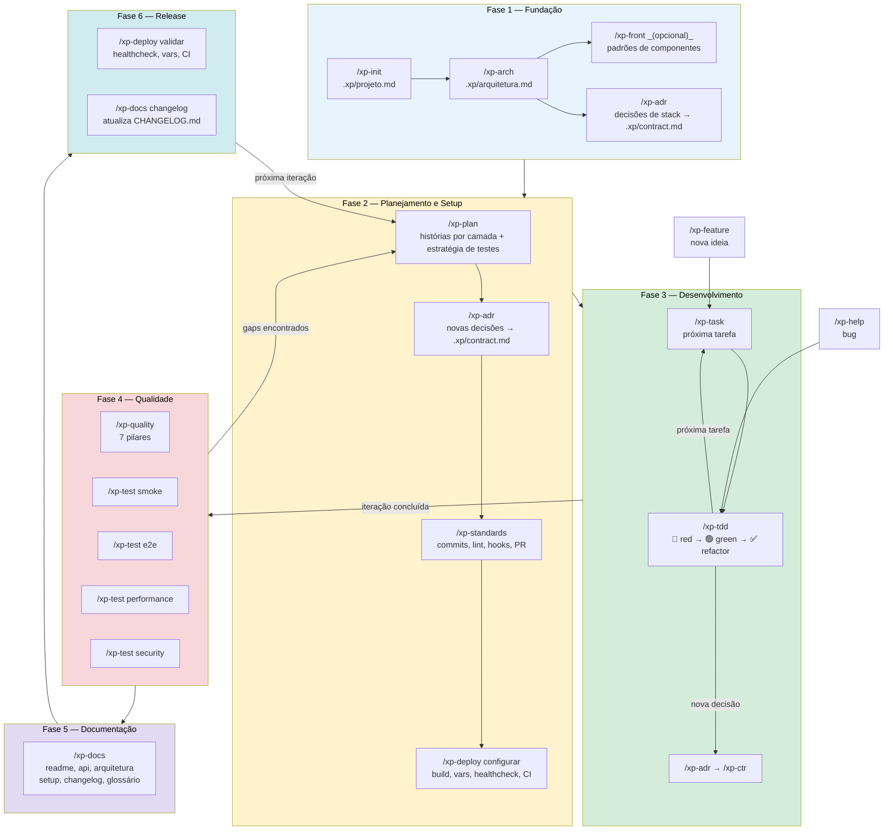

# @multitech/xp-skill

Instala a metodologia **Extreme Programming (XP)** no seu projeto via Claude Code.

Após a instalação, o Claude age como seu **par de programação**, seguindo TDD e as práticas XP — planejamento colaborativo, ciclo red → green → refactor, backlog e contrato gerenciados junto.

---

## Fluxo 1 — Projeto novo



---

## Fluxo 2 — Projeto em andamento



---

## Fluxo 3 — Decisões e Contrato



---

## Instalação

Na raiz do projeto onde você quer usar XP:

```bash
npx @multitech/xp-skill
```

O que é instalado:

```
seu-projeto/
  CLAUDE.md                        ← regras XP adicionadas (ou criadas)
  .claude/
    skills/
      xp-init/SKILL.md             ← skill /xp-init
      xp-arch/SKILL.md             ← skill /xp-arch
      xp-front/SKILL.md            ← skill /xp-front
      xp-plan/SKILL.md             ← skill /xp-plan
      xp-task/SKILL.md             ← skill /xp-task
      xp-tdd/SKILL.md              ← skill /xp-tdd
      xp-help/SKILL.md             ← skill /xp-help
      xp-feature/SKILL.md          ← skill /xp-feature
      xp-adr/SKILL.md              ← skill /xp-adr
      xp-ctr/SKILL.md              ← skill /xp-ctr
      xp-quality/SKILL.md          ← skill /xp-quality
      xp-test/SKILL.md             ← skill /xp-test
      xp-docs/SKILL.md             ← skill /xp-docs
      xp-deploy/SKILL.md           ← skill /xp-deploy
      xp-standards/SKILL.md        ← skill /xp-standards
```

### Projeto que já tem CLAUDE.md

As regras XP são **adicionadas ao final** do seu CLAUDE.md existente, sem sobrescrever o conteúdo atual.

Para sobrescrever forçadamente:

```bash
npx @multitech/xp-skill --force
```

---

## Skills disponíveis

| Skill | Quando usar |
|---|---|
| `/xp-init` | Início de projeto — define visão de negócio |
| `/xp-arch` | Define as camadas técnicas do sistema — frontend, backend, banco, integrações |
| `/xp-front` | _(opcional)_ Define padrões de frontend — componentes, pastas, estado, estilo, formulários |
| `/xp-plan` | Planejamento da iteração — cria e prioriza o backlog por camada |
| `/xp-task` | Pega a próxima tarefa e executa o ciclo TDD |
| `/xp-tdd` | Ciclo TDD avulso — spike, experimento, hotfix |
| `/xp-help` | App com problema — investiga, reproduz e corrige com TDD |
| `/xp-feature` | Nova ideia durante o projeto — avalia, registra e executa |
| `/xp-adr` | Registra uma decisão arquitetural com contexto e alternativas |
| `/xp-ctr` | Gerencia o `.xp/contract.md` — regras ativas do projeto |
| `/xp-quality` | Audita os 7 pilares de qualidade e gera relatório para o `/xp-plan` |
| `/xp-test` | Executa testes dinâmicos: smoke, e2e, performance, security |
| `/xp-docs` | Cria ou atualiza toda a documentação do projeto |
| `/xp-deploy` | Configura e valida o processo de deploy (agnóstico de plataforma) |
| `/xp-standards` | Configura padrões: commits, lint, format, hooks, branches, PR template |

---

## Arquivos gerados no projeto

| Arquivo | O quê |
|---|---|
| `.xp/projeto.md` | Visão de negócio, objetivos e evolução do projeto |
| `.xp/arquitetura.md` | Camadas do sistema, stack por camada, diagrama e integrações |
| `.xp/frontend.md` | Padrões de frontend — componentes, estado, estilo _(criado pelo /xp-front)_ |
| `.xp/xp-backlog.md` | Histórias, tarefas e iterações |
| `.xp/contract.md` | Regras ativas — carregado em todo chat e por todo agente |
| `.xp/decisions/ADR-NNN.md` | Histórico de decisões arquiteturais |
| `docs/doc_api.md` | Documentação da API |
| `docs/doc_arquitetura.md` | Documentação de arquitetura para humanos |
| `docs/doc_setup.md` | Guia de setup do ambiente |
| `docs/doc_glossario.md` | Glossário de termos do projeto |

---

## Como usar

### 1. Visão do projeto — `/xp-init`

Define o "porquê" antes de qualquer tarefa técnica. Conduz um discovery conversacional e cria o `.xp/projeto.md`. Sem decisões técnicas ainda — só negócio.

```
/xp-init
```

### 2. Arquitetura do sistema — `/xp-arch`

Define as camadas técnicas do sistema com base na visão de negócio: tipo de sistema (web app, API, mobile...), stack por camada (frontend, backend, banco), integrações externas e diagrama de comunicação. Cria o `.xp/arquitetura.md` e dispara `/xp-adr` para cada decisão de tecnologia.

```
/xp-arch
```

Sem `.xp/arquitetura.md`, o `/xp-plan` não sabe quais camadas existem e cria histórias incompletas — ex: planeja o backend mas esquece o frontend.

### 3. Padrões de frontend — `/xp-front` _(opcional)_

Define as convenções de como escrevemos o frontend — não escolhe tecnologias (isso é o `/xp-arch`), mas define como usamos o que foi escolhido. Recomendado para projetos com frontend real.

```
/xp-front
```

Cobre 8 áreas: estrutura de pastas, padrão de componentes, gerenciamento de estado, camada de API, CSS/estilo, formulários, acessibilidade e i18n. Ao final, cria `.xp/frontend.md` com todos os padrões e adiciona referência no `.xp/arquitetura.md`. Registra as decisões via `/xp-adr`.

### 4. Planejamento — `/xp-plan`

Planning Game da iteração. Lê `.xp/projeto.md` e `.xp/arquitetura.md`, levanta histórias, decompõe tarefas por camada (frontend + backend + integração), define estratégia de testes, estima, agrupa por tema e cria o `.xp/xp-backlog.md`.

```
/xp-plan
```

### 5. Próxima tarefa — `/xp-task`

Lê o backlog, pega a primeira tarefa pendente e aciona `/xp-tdd` automaticamente.

```
/xp-task       ← próxima tarefa pendente
/xp-task 3     ← tarefa específica por ID
```

### 6. Ciclo TDD avulso — `/xp-tdd`

Para spikes, experimentos ou hotfixes fora do backlog.

```
/xp-tdd validar que usuário não pode ter email duplicado
```

| Fase | O que acontece |
|------|----------------|
| 🔴 **Red** | Escreve o teste que deve falhar |
| 🟢 **Green** | Escreve o mínimo para o teste passar |
| ✅ **Refactor** | Melhora o código sem quebrar os testes |

### 7. Investigar um problema — `/xp-help`

Quando o app está rodando e algo não funciona. Conduz 4 fases: entender → reproduzir → corrigir com TDD → prevenir. Ao final, sugere registrar se o bug revelou uma regra nova.

```
/xp-help o botão de salvar não está respondendo
/xp-help a listagem retorna vazia mas o banco tem dados
/xp-help investiga por que o login falha apenas no mobile
```

### 8. Nova feature em andamento — `/xp-feature`

Avalia escopo, verifica impacto, registra em `.xp/projeto.md` e decide o caminho: TDD direto (pequeno) ou backlog (grande). Ao final, sugere registrar decisões como ADR.

```
/xp-feature quero adicionar login com Google
```

### 9. Registrar uma decisão — `/xp-adr`

Documenta uma decisão arquitetural com contexto, alternativas e consequências. Ao final, aciona `/xp-ctr` para adicionar a regra resultante ao contrato.

```
/xp-adr vamos usar JWT para autenticação
```

Cria `.xp/decisions/ADR-001-autenticacao-jwt.md`. ADRs são imutáveis — decisões revisadas geram um novo ADR que supersede o anterior.

### 10. Gerenciar o contrato — `/xp-ctr`

Adiciona, lista ou remove regras ativas do `.xp/contract.md`. Esse arquivo é lido automaticamente em toda sessão pelo `CLAUDE.md`.

```
/xp-ctr        ← abre menu (adicionar / listar / remover / revisar)
```

Categorias de regras: `Negócio`, `Infra`, `Arquitetura`, `Convenção`, `Segurança`.

### 11. Auditar qualidade do projeto — `/xp-quality`

Skill independente — rode a qualquer momento para obter um diagnóstico completo dos 7 pilares de qualidade do projeto. Detecta a stack automaticamente e avalia cada pilar com ferramentas específicas para a linguagem.

```
/xp-quality
```

**Os 7 pilares auditados:**

| # | Pilar | O que verifica |
|---|-------|----------------|
| 1 | Análise estática | Lint configurado com regras ativas |
| 2 | Tipagem estática | Type checker em modo estrito |
| 3 | Suite de testes | Framework configurado, testes passando |
| 4 | Cobertura de testes | Threshold mínimo definido (recomendado: 80%) |
| 5 | Validação de arquitetura | Regras de dependência entre camadas |
| 6 | Análise de segurança | Vulnerabilidades no código-fonte |
| 7 | Auditoria de dependências | CVEs em bibliotecas externas |

Cada pilar recebe um status:

| Status | Significado |
|--------|-------------|
| ✅ `OK` | Configurado, executável e passando |
| ⚠️ `Parcial` | Configurado mas com problemas ou incompleto |
| ❌ `Ausente` | Não configurado ou sem ferramenta definida |

**Saída:** relatório com score (`X/7 pilares OK`), lista de problemas críticos e melhorias, e recomendações de ferramentas específicas para a stack detectada.

**Próximo passo:** o relatório é enviado ao `/xp-plan` que cria as tarefas de melhoria priorizadas — críticos primeiro.

---

## Fluxo 4 — Qualidade



### 12. Executar testes dinâmicos — `/xp-test`

Executa testes e validações contra o app em execução. Não escreve testes — executa e valida. Tem 4 modos:

```
/xp-test smoke       → app está de pé e respondendo?
/xp-test e2e         → jornadas do usuário passando?
/xp-test performance → endpoints dentro do tempo esperado?
/xp-test security    → vulnerabilidades dinâmicas expostas?
/xp-test             → menu para escolher o modo
```

| Modo | Precisa de código pré-escrito? | Pré-requisito |
|------|-------------------------------|---------------|
| `smoke` | Não | App rodando |
| `e2e` | Sim — testes Playwright/Cypress | App rodando + testes escritos |
| `performance` | Não | App rodando |
| `security` | Não | App rodando em ambiente de **teste** |

**E2E sem testes escritos?** A skill orienta a criar via `/xp-task` com uma história `[E2E]` do backlog — que o `/xp-plan` gera automaticamente para jornadas críticas.

---

## Fluxo 5 — Testes Dinâmicos



### 13. Documentar o projeto — `/xp-docs`

Skill independente para criar ou atualizar toda a documentação. Não interfere no fluxo de implementação — rode a qualquer momento.

```
/xp-docs              → auditoria: lista o que existe, está desatualizado ou falta
/xp-docs readme       → README.md na raiz
/xp-docs api          → docs/doc_api.md
/xp-docs arquitetura  → docs/doc_arquitetura.md
/xp-docs setup        → docs/doc_setup.md
/xp-docs changelog    → CHANGELOG.md na raiz
/xp-docs glossario    → docs/doc_glossario.md
/xp-docs codigo       → JSDoc / docstrings inline no código
/xp-docs env          → valida e atualiza .env.example
```

**Estrutura de arquivos gerada:**

```
projeto/
  README.md            ← visão geral, instalação, uso
  CHANGELOG.md         ← histórico de versões (Keep a Changelog)
  .env.example         ← variáveis documentadas e explicadas
  docs/
    doc_api.md           ← endpoints, contratos, exemplos
    doc_arquitetura.md   ← visão geral, camadas, diagramas Mermaid
    doc_setup.md         ← ambiente do zero, comandos, erros comuns
    doc_glossario.md     ← dicionário de termos técnicos e de negócio
```

**Modo auditoria** gera um relatório com score (`X/8 OK`) e prioridade de atualização — pode ser enviado ao `/xp-plan` para criar tarefas de documentação.

---

## Fluxo Completo — Do Zero ao Deploy

Visão geral de todo o ciclo de vida de um projeto usando todas as skills. Divido em 6 fases — cada fase tem skills primárias e opcionais.



---

### Fase 1 — Fundação _(uma vez por projeto)_

```
/xp-init
  → discovery conversacional (problema, solução, usuários, objetivos, restrições)
  → cria .xp/projeto.md com seção de Evolução
  → sem decisões técnicas ainda — só negócio

/xp-arch
  → lê .xp/projeto.md para entender o domínio
  → define o tipo de sistema: web app? API? mobile? CLI?
  → mapeia camadas: frontend, backend, banco, mobile
  → para cada camada: tecnologia, responsabilidade, como se comunica
  → mapeia integrações externas (email, pagamentos, OAuth, storage...)
  → gera diagrama Mermaid das camadas
  → cria .xp/arquitetura.md

/xp-front (opcional — se o sistema tem frontend)
  → lê .xp/arquitetura.md para saber o framework escolhido
  → define estrutura de pastas (feature-based, por tipo, híbrida)
  → define padrão de componentes (nomenclatura, critério de extração, co-location)
  → define gerenciamento de estado (quando local, quando global, quando server state)
  → define camada de API (services/, hooks de dados, cliente HTTP central)
  → define convenções de CSS para o que foi escolhido (Tailwind, CSS Modules...)
  → define tratamento de formulários e validação
  → define acessibilidade mínima obrigatória
  → adiciona seção "Padrões de Frontend" no .xp/arquitetura.md

/xp-adr (para cada decisão de stack)
  → "vamos usar React + TypeScript no frontend"
  → "Node.js + Express no backend"
  → "PostgreSQL + Prisma"
  → cria .xp/decisions/ADR-NNN.md para cada uma
  → aciona /xp-ctr → .xp/contract.md atualizado
```

---

### Fase 2 — Planejamento e Setup _(primeira iteração)_

```
/xp-plan
  → lê .xp/projeto.md (negócio) + arquitetura.md (camadas)
  → coleta histórias da iteração
  → para cada história, decompõe por camada:
      "usuário pode fazer login" →
        [ ] Frontend: tela de login + formulário + validação
        [ ] Backend: POST /auth/login → valida credenciais, retorna JWT
        [ ] Integração: frontend chama backend; trata 401
        [ ] Banco: query de busca de usuário por email
  → define estratégia de testes por história:
        unitário (sempre) | integração (fronteiras) | E2E (jornada completa)
      → histórias [E2E] criadas automaticamente no tema Testes
  → agrupa por tema (Core, Auth, Infra, UI, Testes...)
  → prioriza por valor de negócio
  → salva .xp/xp-backlog.md

/xp-adr (se surgir nova decisão durante o plan)
  → cria .xp/decisions/ADR-NNN.md
  → aciona /xp-ctr → .xp/contract.md atualizado

/xp-standards tudo
  → agora conhece a stack → configura para ela
  → commitlint (Conventional Commits)
  → ESLint + typescript-eslint (stack: TypeScript)
  → Prettier
  → Husky: pre-commit + commit-msg + pre-push
  → convenção de branches documentada
  → PR template criado
  → commit: chore: configurar padrões do projeto

/xp-deploy configurar
  → agora conhece a plataforma (Fly.io, decidida no /xp-adr)
  → build definido e testado
  → variáveis de ambiente mapeadas no .env.example
  → healthcheck implementado
  → pipeline CI/CD configurado
  → estratégia de rollback definida
```

---

### Fase 3 — Desenvolvimento _(por tarefa)_

```
/xp-task
  → lê .xp/xp-backlog.md, pega primeira tarefa pendente
  → marca [~] em andamento
  → aciona /xp-tdd com o comportamento da tarefa

/xp-tdd <comportamento>
  → define nível: unitário ou integração
  → 🔴 Red: escreve teste que falha
  → 🟢 Green: implementação mínima
  → ✅ Refactor: limpa sem quebrar
  → sugere commit: test: ... / feat: ...
  → repete para cada comportamento da tarefa

/xp-task (ao concluir)
  → marca [x] concluída
  → mostra progresso da iteração
  → sugere próxima tarefa

─── se surgir bug durante o desenvolvimento ───
/xp-help <problema>
  → investiga → reproduz → corrige com TDD → previne
  → sugere /xp-adr se revelou regra nova

─── se surgir nova ideia durante o desenvolvimento ───
/xp-feature <ideia>
  → entende → estima → registra em .xp/projeto.md
  → escopo pequeno → /xp-tdd direto
  → escopo grande → adiciona ao backlog

─── se surgir decisão arquitetural ───
/xp-adr <decisão>
  → cria .xp/decisions/ADR-NNN.md
  → aciona /xp-ctr → .xp/contract.md atualizado
```

---

### Fase 4 — Qualidade _(ao fim de cada iteração)_

```
/xp-quality
  → detecta stack
  → audita 7 pilares: análise estática, tipagem, testes,
    cobertura, arquitetura, segurança, dependências
  → score X/7 → gaps viram tarefas no próximo /xp-plan

/xp-test smoke
  → verifica endpoints críticos, status HTTP, healthcheck
  → falhas → /xp-help

/xp-test e2e
  → executa Playwright / Cypress existentes
  → falhas → /xp-help
  → sem testes → /xp-plan cria histórias [E2E]

/xp-test performance
  → mede tempos de resposta dos endpoints críticos
  → endpoints lentos → tarefa no backlog

/xp-test security
  → valida OWASP Top 10 dinamicamente (ambiente de teste)
  → vulnerabilidades críticas → /xp-help imediato
  → melhorias → tarefa no backlog
```

---

### Fase 5 — Documentação _(ao fim de cada iteração ou sob demanda)_

```
/xp-docs
  → auditoria: score X/8 documentos OK

/xp-docs readme       → README.md atualizado
/xp-docs api          → docs/doc_api.md com endpoints da iteração
/xp-docs arquitetura  → docs/doc_arquitetura.md com decisões da iteração
/xp-docs glossario    → docs/doc_glossario.md com novos termos
/xp-docs env          → .env.example validado contra código e .env real
/xp-docs codigo       → JSDoc / docstrings nas funções públicas novas
```

---

### Fase 6 — Release _(ao preparar uma versão)_

```
/xp-deploy validar
  → healthcheck respondendo
  → todas as variáveis do .env.example presentes em produção
  → build reproduzível
  → auditoria de dependências limpa

/xp-docs changelog
  → lê commits desde a última versão (git log)
  → agrupa por categoria (feat, fix, refactor...)
  → reescreve em linguagem de usuário
  → atualiza CHANGELOG.md

─── deploy via CI/CD ───
  → lint + typecheck + test passando
  → build gerado
  → deploy na plataforma configurada
  → healthcheck confirmado pós-deploy

─── próxima iteração ───
/xp-plan (volta para Fase 2)
```

---

### Referência rápida — Quando usar cada skill

| Momento | Skill |
|---------|-------|
| Projeto novo | `/xp-init` → `/xp-arch` → `/xp-front` _(se frontend)_ → `/xp-adr` → `/xp-plan` |
| Início de iteração | `/xp-plan` |
| Implementar tarefa | `/xp-task` → `/xp-tdd` |
| Bug no app | `/xp-help` |
| Nova ideia | `/xp-feature` |
| Decisão técnica | `/xp-adr` → `/xp-ctr` |
| Revisar contrato | `/xp-ctr` |
| Fim de iteração | `/xp-quality` → `/xp-test` → `/xp-docs` |
| Preparar release | `/xp-deploy validar` → `/xp-docs changelog` |
| Qualquer momento | `/xp-tdd` (spike/experimento) |

---

## Fluxo típico de uma sessão

**Projeto novo:**
```
/xp-init          → discovery → .xp/projeto.md (negócio)
/xp-arch          → camadas + stack → .xp/arquitetura.md
/xp-front         → padrões de componentes, estado, estilo → .xp/arquitetura.md (opcional)
/xp-adr           → registra decisões de stack → .xp/decisions/ + contract.md
/xp-plan          → lê .xp/projeto.md + arquitetura.md → histórias por camada → .xp/xp-backlog.md
/xp-standards     → configura lint, hooks, commits para a stack decidida
/xp-deploy        → configura build e CI/CD para a plataforma decidida
/xp-task          → tarefa #1 → aciona /xp-tdd
  🔴 red → 🟢 green → ✅ refactor
/xp-task          → tarefa #2 ...
```

**Corrigindo um problema:**
```
/xp-help botão de salvar não responde
  🔍 investiga → formula hipótese
  🔁 reproduz  → teste que captura o bug
  🔴 red → 🟢 green → ✅ refactor
  📋 sugere /xp-adr se revelou regra nova
```

**Nova ideia:**
```
/xp-feature login com Google
  💡 entende → user story + critério de aceite
  📏 avalia  → estimativa + impacto
  📋 registra → .xp/projeto.md (+ backlog se grande)
  ⚡ executa → /xp-tdd ou /xp-task
  📋 sugere /xp-adr se gerou decisão arquitetural
```

**Registrando uma decisão:**
```
/xp-adr toda API retorna envelope { data, error }
  → .xp/decisions/ADR-002-envelope-de-resposta.md
  → /xp-ctr adiciona regra em .xp/contract.md
  → .xp/contract.md carregado em todo chat futuro
```

**Rodando testes dinâmicos:**
```
/xp-test smoke
  ✅ GET /         → 200 (32ms)
  ✅ GET /health   → 200 (11ms)
  ❌ POST /orders  → 500
  → sugere /xp-help para investigar

/xp-test e2e
  ✅ 12 passando
  ❌ 1 falhando: "checkout com cartão expirado"
  → sugere /xp-help para investigar

/xp-test performance
  ✅ GET /products → 95ms
  ❌ GET /reports  → 2.3s (crítico)
  → sugere tarefa no backlog

/xp-test security
  ❌ Rate limiting ausente
  ⚠️ CSP header ausente
  → vulnerabilidade crítica → /xp-help
  → melhoria → /xp-plan cria tarefa
```

**Configurando padrões:**
```
/xp-standards tudo
  ✅ commitlint     → Conventional Commits configurado
  ✅ eslint         → regras strict + security habilitadas
  ✅ prettier       → formatação automática
  ✅ husky          → pre-commit (lint) + commit-msg + pre-push (test)
  ✅ branches       → convenção feat/fix/chore documentada
  ✅ PR template    → .github/pull_request_template.md criado
  → commit: chore: configurar padrões do projeto

/xp-deploy configurar
  ✅ build          → npm run build funcional
  ✅ variáveis      → todas do .env.example mapeadas
  ✅ healthcheck    → GET /health implementado
  ✅ CI/CD          → deploy só após lint + test passando
  ⚠️ rollback       → estratégia a definir
```

**Auditando qualidade:**
```
/xp-quality
  🔍 detecta stack → Node.js / TypeScript
  📋 audita 7 pilares
    ✅ análise estática    → ESLint configurado
    ✅ tipagem estática    → tsc strict mode
    ✅ suite de testes     → Jest, todos passando
    ⚠️ cobertura          → 62% (abaixo do threshold)
    ❌ validação arquit.  → dependency-cruiser ausente
    ⚠️ análise segurança  → Semgrep não integrado ao CI
    ✅ auditoria deps     → npm audit limpo
  📊 score: 3/7 OK
  → /xp-plan cria tarefas para os pilares ❌ e ⚠️
```

---

## O que o Claude faz como par

- Nunca escreve implementação antes do teste falhar
- Aponta code smells pelo nome (Long Method, Feature Envy, etc.)
- Respeita YAGNI: não implementa além do que o teste pede
- Lê o `.xp/contract.md` e respeita todas as regras registradas
- Sugere registrar decisões e regras nos momentos certos

---

## Atualizar as skills

```bash
npx @multitech/xp-skill@latest
```

---

## Contribuindo

Este repositório é a fonte das skills e do CLAUDE.md. Para propor mudanças no comportamento do par ou nas skills, abra um PR.
